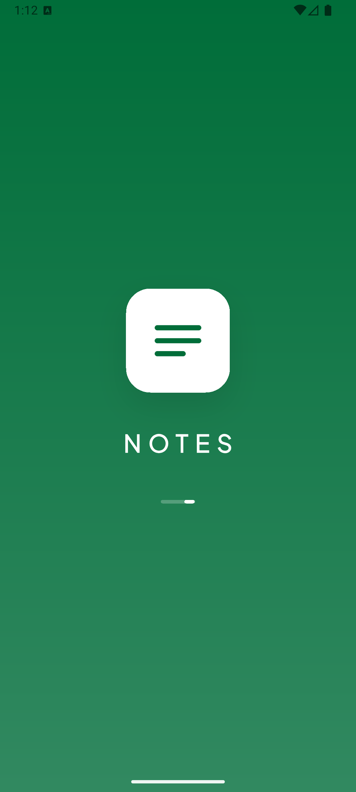
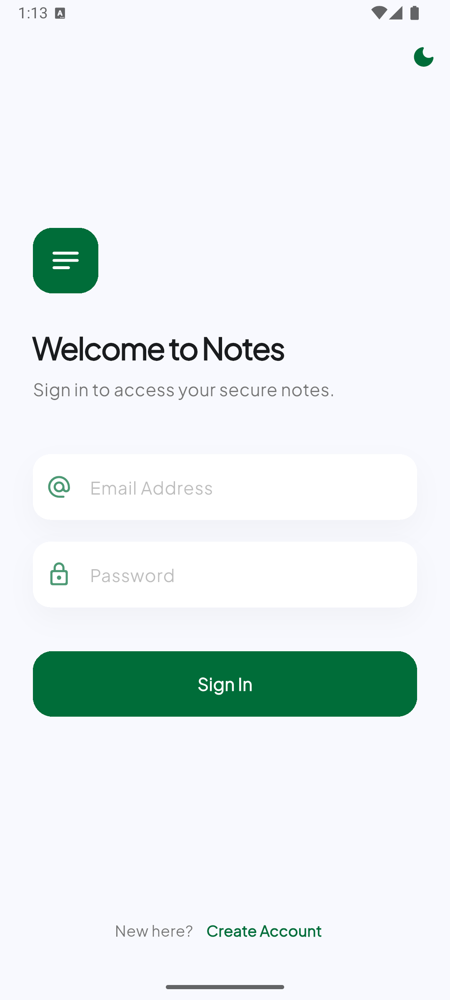
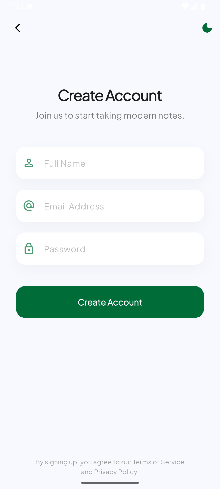
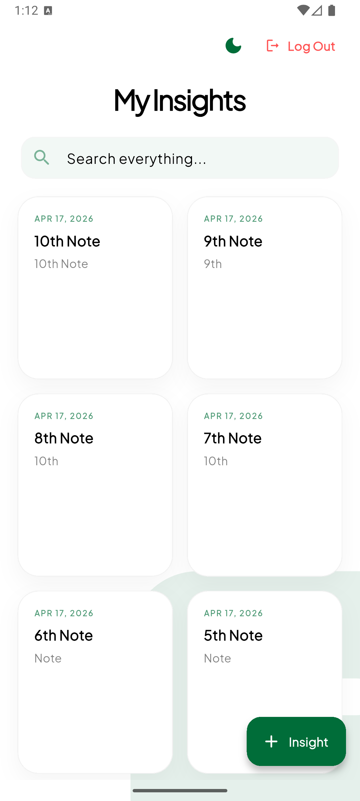
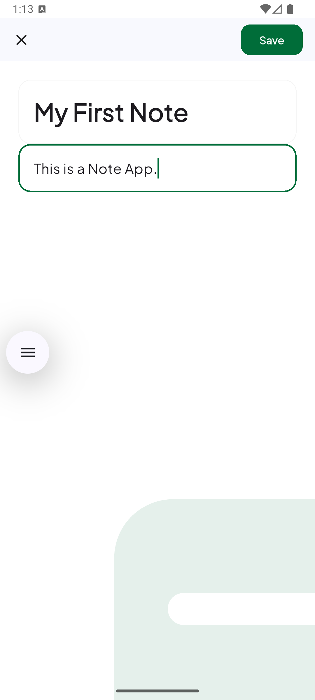
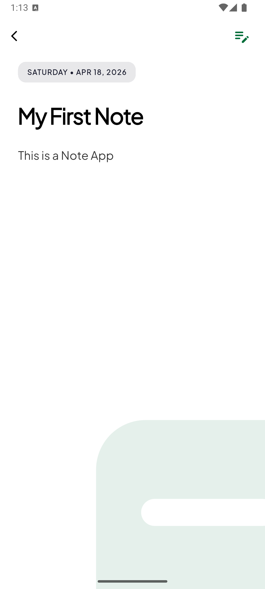

# Notes App - Caretutors Assignment

A modern, offline-first Notes application built with Flutter using Clean Architecture, Riverpod for state management, and GoRouter for navigation.

## 📱 Screenshots

| Splash & Auth | Home & Add Note |
| :---: | :---: |
|    |    |

---

## 🚀 Features

- **Animated Splash Screen**: Slick entry animation with brand identity.
- **Secure Authentication**: Firebase-backed Email/Password Login and Registration.
- **Notes Management**: Full CRUD (Create, Read, Update, Delete) operations.
- **Real-time Sync**: Uses Cloud Firestore for instant data persistence.
- **Modern UI/UX**: Clean design with custom text fields, form validation, and dark/light mode support.

## 🏗 Architecture & Tech Stack

This project follows **Clean Architecture** principles to ensure scalability, testability, and maintainability.

- **Presentation Layer**: Flutter Hooks + Riverpod (HookConsumerWidget).
- **Domain Layer**: Entities, Repositories (interfaces), and Use Cases.
- **Data Layer**: Models (DTOs), Repository Implementations, and Remote Data Sources.

### Folder Structure
```text
lib/
├── core/                       # Shared modules (Navigation, DI, Theme)
├── features/
│   ├── auth/                   # Authentication Feature
│   │   ├── data/               # Models, Repo Impls, Data Sources
│   │   ├── domain/             # Entities, Repo Interfaces, Use Cases
│   │   └── presentation/       # Riverpod Providers, Screens, Widgets
│   ├── notes/                  # Notes CRUD Feature
│   │   ├── data/               # Note Models & Repo Impls
│   │   ├── domain/             # Note Entities & Use Cases
│   │   └── presentation/       # Notes UI & State Management
│   └── splash/                 # App Initialization & Splash Logic
│       └── presentation/       # Initial entry and routing logic
├── firebase_options.dart       # Generated Firebase config
└── main.dart                   # App Entry point
```

### Key Libraries
- **State Management**: `hooks_riverpod` & `flutter_hooks` for reactive UI.
- **Navigation**: `go_router` for declarative routing.
- **Backend**: `firebase_auth` (Security) & `cloud_firestore` (Database).
- **Icons**: `material_design_icons_flutter`.

### Project Structure
- **Core**: Contains global configurations, theme data, and the router.
- **Features**: Divided into Splash, Auth, and Notes. Each feature contains:
  - **Data**: Models and Repository implementations.
  - **Domain**: Entities and Use Cases.
  - **Presentation**: UI Screens, Widgets, and Riverpod Providers.

## 🛠 Getting Started

### Prerequisites
- **Flutter SDK**: `^3.32.5` (Stable)
- **Dart SDK**: `^3.8.1`
- **Firebase CLI**: Installed and logged in for configuration.
- 
## 🛠 Setup Instructions

1. **Clone the repository**:
   ```bash
   git clone [https://github.com/Mahfuz-00/caretutors_assignment.git](https://github.com/Mahfuz-00/caretutors_assignment.git)
   ```
   
2. **Install dependencies**:
    ```bash
    flutter pub get
    ```
   
3. **Firebase Configuration**:
- The project includes `firebase_options.dart`.
- Ensure your environment is set up with the **FlutterFire CLI** if you wish to reconfigure.

4. **Run the app**:
   ```bash
   flutter run
   ```

---
**Developed by Md. Abdullah al Mahfuz**
   
